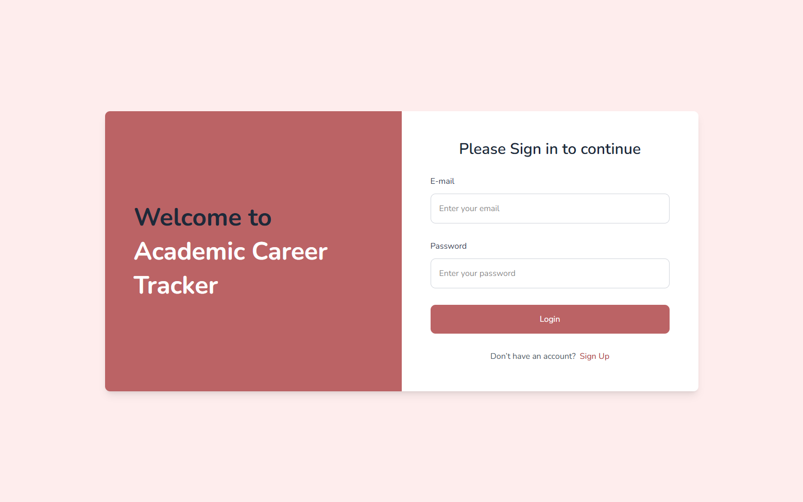
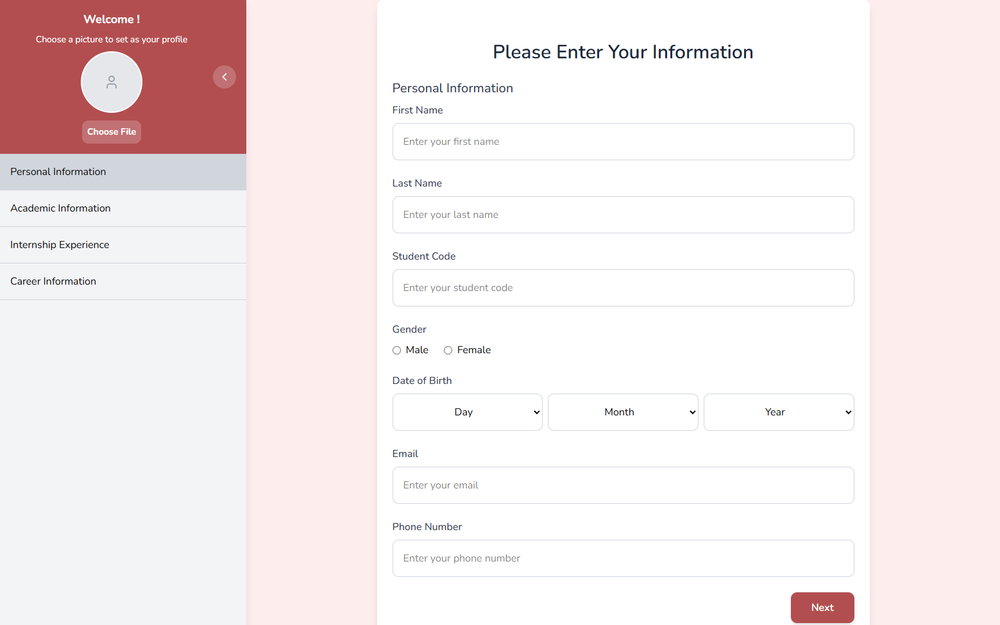
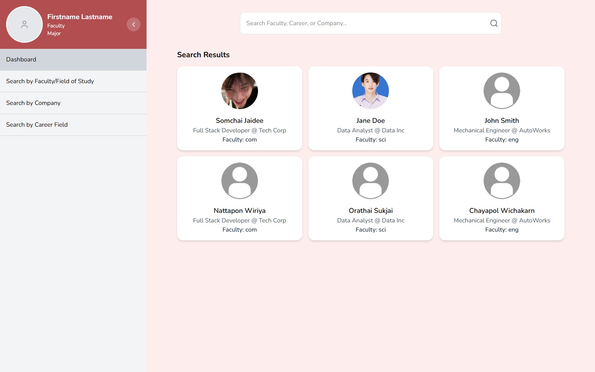
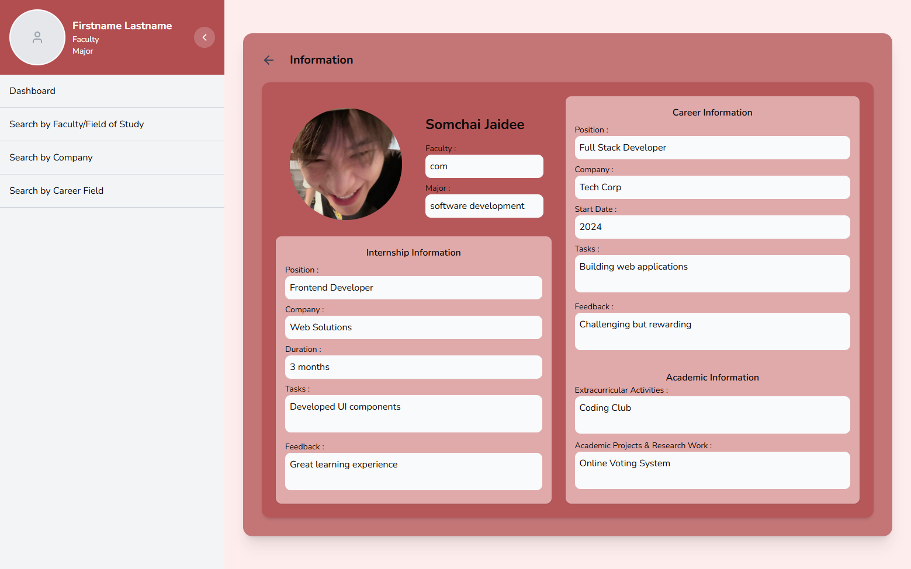

# Academic Career Tracker 🎓

Academic Career Tracker is a web application designed to track the career paths of university graduates. It allows the public to explore alumni career outcomes, while graduates can contribute their own career information to the system.

## 🌐 Live Demo

[https://your-vercel-link.vercel.app](https://academic-tracker-frontend.vercel.app/)

```bash
Test Login
Email: test@gmail.com
Password: 123456
```

## 📌 Features

* Browse career paths of graduates 🔍
* Alumni can submit their career information 🧑‍🎓

## 🛠️ Tech Stack
* Frontend: React + Vite
* Styling: Tailwind CSS
* Data: Mock Data (no backend)
* Deployment: Vercel

## 🚀 Getting Started

```bash
# Install dependencies
npm install

# Run development server
npm run dev
```

## 📸 Screenshots

### Login


### Role Selection


### Information Form 


### Dashboard (Career Overview)


### Information Page (Career Details)


## 📌 Future Improvements
* Connect to real backend / database
* Authentication system (JWT / OAuth)
* Advanced filtering & analytics
